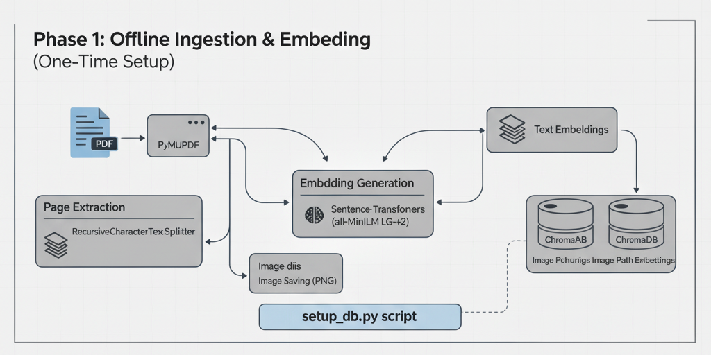
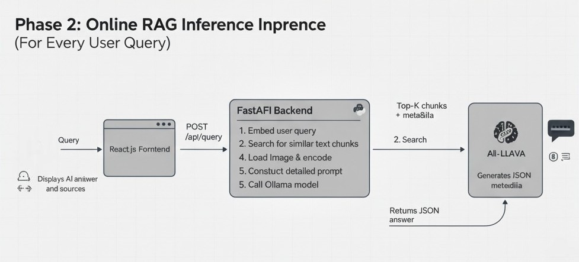

<p align="center">
  <h1 align="center">Visual RAG AI Assistant for Computer Vision</h1>
  <h3 align="center">
      <strong align="center">A local-first Retrieval-Augmented Generation (RAG) system with LLM reasoning.</strong>
  </h3>
</p>

<p align="center">
  
</p>

<p align="center">
  
  
  
  
  
</p>

---

## Overview

This system enables **local question-answering over a computer vision textbook**, using a **RAG pipeline** combined with a **vision-capable LLM** (LLaVA).  
No external APIs. No cloud. No data leaves your machine.

---

## Features

<div align="center">

| Capability | Description |
|----------|-------------|
| **Natural Language Chat** | Conversational querying of textbook content. |
| **PDF Ingestion** | Text extraction and per-page image rendering. |
| **Vector Search** | ChromaDB used for semantic retrieval. |
| **Multimodal LLM** | LLaVA can reference and interpret pages. |
| **Source Citations** | Every answer lists the originating page(s). |
| **Full-Stack System** | React frontend + FastAPI backend. |

</div>

---

## Architecture

<p align="center">
  
  
</p>

```mermaid
graph TD
    User --> Frontend[React Web UI]
    Frontend --> Backend[FastAPI Server]
    Backend --> ChromaDB[(Vector Store)]
    Backend --> LLaVA[Ollama Vision LLM]
    ChromaDB --> Backend
    LLaVA --> Backend
    Backend --> Frontend
````

---

## Tech Stack

<div align="center">

| Layer                   | Tools                                     |
| ----------------------- | ----------------------------------------- |
| **UI**                  | React, CSS                                |
| **API**                 | FastAPI                                   |
| **Model Runtime**       | Ollama                                    |
| **Model**               | LLaVA                                     |
| **Vector DB**           | ChromaDB                                  |
| **Text + PDF Handling** | LangChain, PyMuPDF, Sentence-Transformers |

</div>

---

## Directory Layout

```
visual-rag-app/
├── backend/
│   ├── book/                     # Place your PDF here
│   ├── processed_book/           # Generated text + images
│   ├── chroma_db/                # Local vector store
│   ├── main.py                   # API entrypoint
│   ├── rag_core.py               # RAG pipeline logic
│   ├── setup_db.py               # One-time processing
│   └── requirements.txt
└── frontend/
    ├── src/
    │   ├── App.js
    │   └── App.css
    └── package.json
```

---

## Setup

### 1. Install Ollama

[https://ollama.com/download](https://ollama.com/download)

Pull the LLaVA model:

```bash
ollama pull llava
```

### 2. Backend Setup

```bash
cd backend
python3 -m venv venv
source venv/bin/activate   # Windows: .\venv\Scripts\activate
pip install -r requirements.txt
```

Place your PDF in:

```
backend/book/
```

Run processing:

```bash
python setup_db.py
```

### 3. Frontend Setup

```bash
cd frontend
npm install
```

---

## Run the Application

<div align="center">

| Terminal | Command                     | Purpose                 |
| -------- | --------------------------- | ----------------------- |
| 1       | `ollama serve`              | Start model runtime     |
| 2       | `uvicorn main:app --reload` | API on `localhost:8000` |
| 3       | `npm start`                 | UI on `localhost:3000`  |

</div>

---

## Usage

1. Visit `http://localhost:3000`
2. Ask a question from the book
3. Get an answer + page references
4. Validate in your PDF viewer if needed

---

## Roadmap

<div align="center">

| Improvement                      | Status  |
| -------------------------------- | ------- |
| CLIP-based multimodal embeddings | Planned |
| Streaming responses              | Planned |
| Display retrieved images inline  | Planned |
| Persistent chat history          | Planned |
| Docker Compose deployment        | Planned |

</div>

---

## License

MIT License


